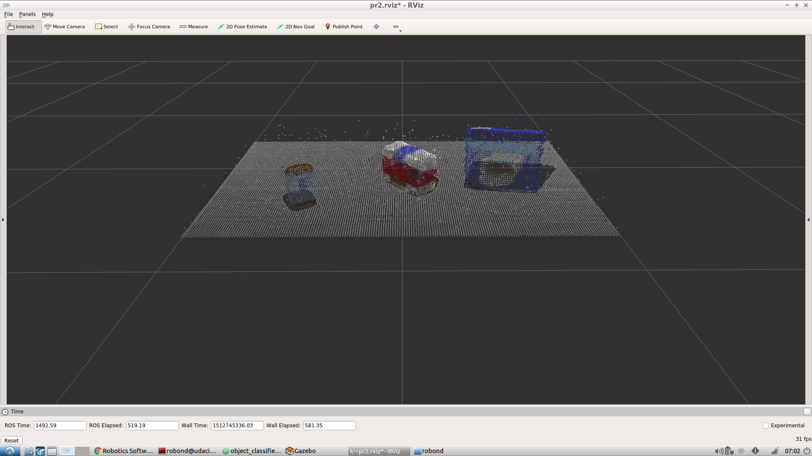
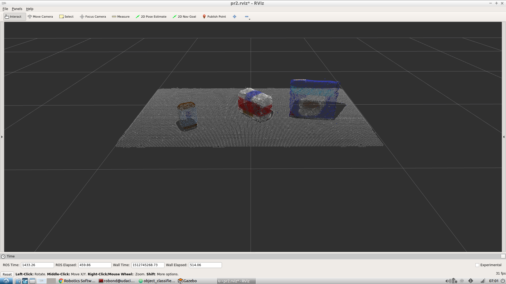
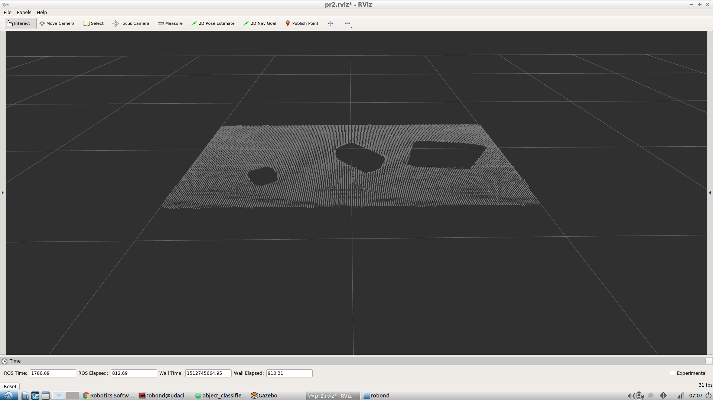
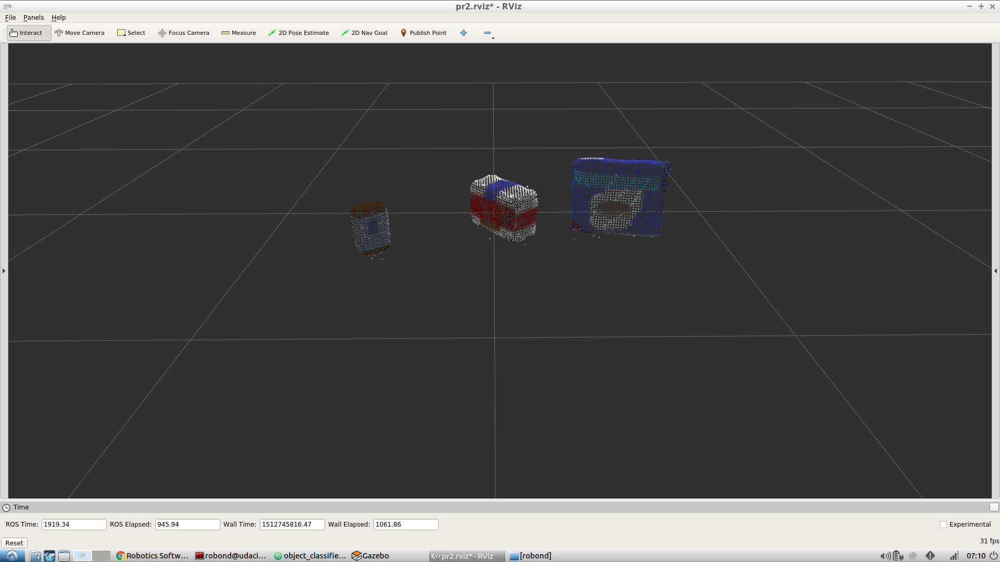
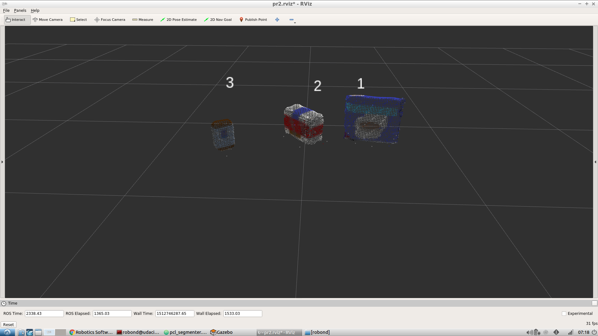
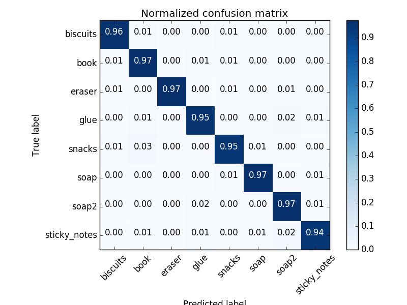
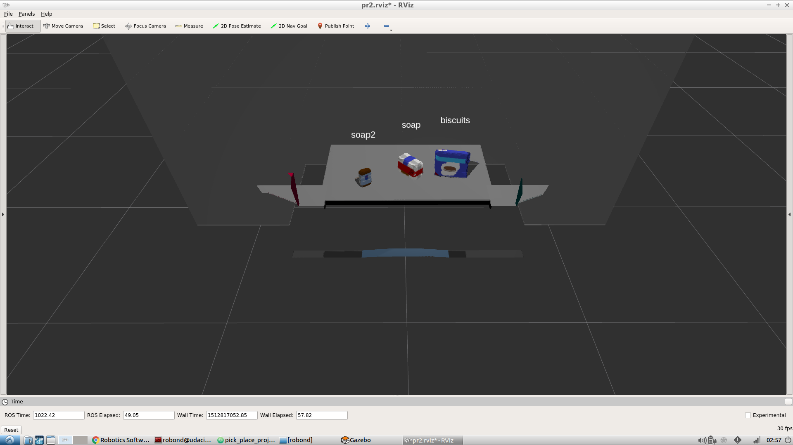
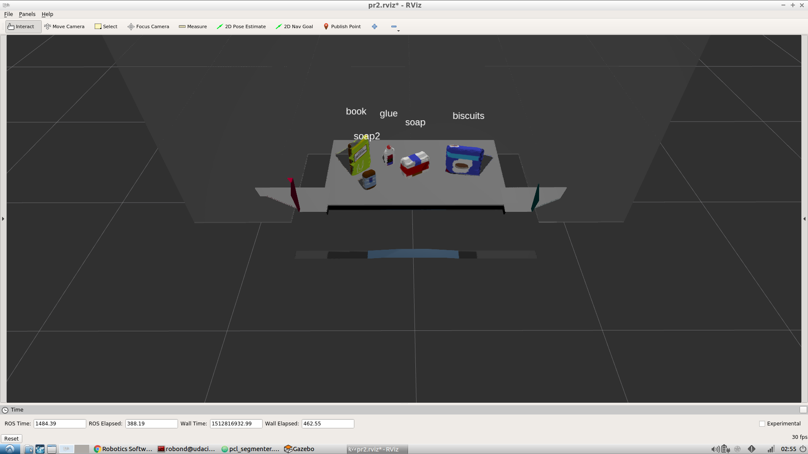
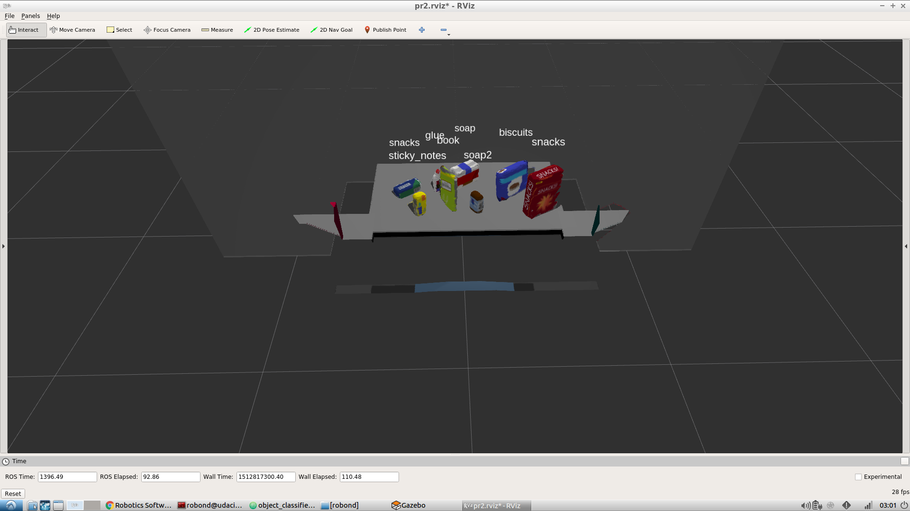

# Perception: Pick & Place

---

## Perception Pipeline Implementation

### 1. PCL Filtering & RANSAC Plane Segmentation

The filtering stage is implemented as follows:

1. Downsample the PCL using <a href="pr2_robot/scripts/pcl_processing/pcl_filter.py">VoxelFilter</a>
2. Extract ROI using <a href="pr2_robot/scripts/pcl_processing/pcl_filter.py">PassThroughFilter</a>. The params can be determined inside RViz using select tool.

3. Denoise the PCL using <a href="pr2_robot/scripts/pcl_processing/pcl_filter.py">OutlierFilter</a>

4. Segment the table using <a href="pr2_robot/scripts/pcl_processing/pcl_segmenter.py">PlaneSegmenter</a>

5. Denoise the objects PCL again using <a href="pr2_robot/scripts/pcl_processing/pcl_filter.py">OutlierFilter</a>


The below snippet is corresponding Python implementation:

```python
  # 1. Voxel grid downsampling
  downsampler = VoxelFilter(
      pcl_original,
      0.005                               # Voxel dimension
  )
  pcl_downsampled = downsampler.filter()

  # 2. PassThrough filter
  pcl_roi = pcl_downsampled
  for axis_name, axis_range in zip(
      ('z', 'y', 'x'),
      (
          [+0.60, +1.20],                 # Upper & lower bounds along z
          [-0.50, +0.50],                 # Upper & lower bounds along y
          [+0.33, +0.90],                 # Upper & lower bounds along x
      )
  ):
      roi_filter = PassThroughFilter(
          pcl_roi,
          axis_name,
          axis_range
      )
      pcl_roi = roi_filter.filter()

  # 3. Outlier filter:
  outlier_filter = OutlierFilter(
      pcl_roi,
      k = 50,                             # Number of neighbors for distance sampling
      factor = 1                          # Standard deviation factor
  )
  pcl_denoised = outlier_filter.filter()

  # 4. RANSAC plane segmentation
  plane_segmenter = PlaneSegmenter(
      pcl_denoised,
      0.005                               # Max distance for plane segmentation
  )
  (idx_table, normal_table) = plane_segmenter.segment()

  # 4. Extract objects:
  pcl_objects = pcl_denoised.extract(idx_table, negative=True)

  # 5. Outlier filter:
  outlier_filter = OutlierFilter(
      pcl_objects,
      k = 25,                            # Number of neighbors for distance sampling
      factor = 1                         # Standard deviation factor
  )
  pcl_objects = outlier_filter.filter()
```

Here all the filters & segmenters are implemented as classes inside my <a href="pr2_robot/scripts/pcl_processing">pcl_processing</a> Python lib

### 2. Object Localization

Separate objects are localized using the following <a href="pr2_robot/scripts/pcl_processing/pcl_segmenter.py">EuclideanSegmenter</a>

```python
  class EuclideanSegmenter():
      """ Segment PCL using DBSCAN
      """
      def __init__(
          self,
          cloud,
          eps = 0.001, min_samples = 10, max_samples = 250
      ):
          """ Instantiate Euclidean segmenter
          """
          # 1. Convert XYZRGB to XYZ:
          self._cloud = XYZRGB_to_XYZ(cloud)
          self._tree = self._cloud.make_kdtree()

          # 2. Set params:
          self._eps = eps
          self._min_samples = min_samples
          self._max_samples = max_samples

          # 3. Create segmenter:
          self._segmenter = self._cloud.make_EuclideanClusterExtraction()
          self._segmenter.set_ClusterTolerance(self._eps)
          self._segmenter.set_MinClusterSize(self._min_samples)
          self._segmenter.set_MaxClusterSize(self._max_samples)
          self._segmenter.set_SearchMethod(self._tree)

      def segment(self):
          """ Segment objects
          """
          # 1. Segment objects:
          cluster_indices = self._segmenter.Extract()

          # 2. Generate representative point for object:
          cluster_reps = []
          for idx_points in cluster_indices:
              object_cloud = self._cloud.extract(idx_points)

              # Use centroid as representative point:
              rep_position = np.mean(
                  object_cloud.to_array(),
                  axis=0
              )[:3]
              rep_position[2] += 0.25

              cluster_reps.append(rep_position)

          return (cluster_indices, cluster_reps)
```

It is used in the callback of PCL classifier to generate PCL indices and representative points for marker labelling as follows:

```python
  object_segmenter = EuclideanSegmenter(
      pcl_objects,
      eps = 0.05, min_samples = 32, max_samples = 4096
  )
  (cluster_indices, cluster_reps) = object_segmenter.segment()
```

Here is an illustration of the effectiveness of this object localization implementation:



### 3. Feature Engineering & Classifer

Here **HSV color space histogram** and **surface normal histogram** are used to extract features of object PCL.

```python
  def compute_color_histograms(cloud, using_hsv=False):
      # Compute histograms for the clusters
      point_colors_list = []

      # Step through each point in the point cloud
      for point in pc2.read_points(cloud, skip_nans=True):
          rgb_list = float_to_rgb(point[3])
          if using_hsv:
              point_colors_list.append(rgb_to_hsv(rgb_list) * 255)
          else:
              point_colors_list.append(rgb_list)

      # Populate lists with color values
      channel_1_vals = []
      channel_2_vals = []
      channel_3_vals = []

      for color in point_colors_list:
          channel_1_vals.append(color[0])
          channel_2_vals.append(color[1])
          channel_3_vals.append(color[2])

      # Compute histogram:
      result = np.concatenate(
          (
              np.histogram(channel_1_vals, bins=32, range=(0,256))[0],
              np.histogram(channel_2_vals, bins=32, range=(0,256))[0],
              np.histogram(channel_3_vals, bins=32, range=(0,256))[0]
          )
      ).astype(np.float64)

      # Normalize the result
      result = result / np.sum(result)

      return result
```

```python
  def compute_normal_histograms(normal_cloud):
      norm_x_vals = []
      norm_y_vals = []
      norm_z_vals = []

      for norm_component in pc2.read_points(
          normal_cloud,
          field_names = ('normal_x', 'normal_y', 'normal_z'),
          skip_nans=True
      ):
          norm_x_vals.append(norm_component[0])
          norm_y_vals.append(norm_component[1])
          norm_z_vals.append(norm_component[2])

      # Compute histogram:
      result = np.concatenate(
          (
              np.histogram(norm_x_vals, bins=32, range=(-1.0,+1.0))[0],
              np.histogram(norm_y_vals, bins=32, range=(-1.0,+1.0))[0],
              np.histogram(norm_z_vals, bins=32, range=(-1.0,+1.0))[0]
          )
      ).astype(np.float64)

      # Normalize the result
      result = result / np.sum(result)

      return result
```

Here **64** bins are used for each channel, aiming to strike a balance between descriptive power and computational efficiency.

Regarding to classifier, I switched from linear SVM to DNN for better classifier performance.
Thanks for sklearn 0.19.1's upgrade of MLPClassifier, all recent advances of deep learning has been integrated to provide a stronger implmentation

```python
  clf = MLPClassifier(
      hidden_layer_sizes = (192, 64),
      batch_size = 512,
      learning_rate_init = 0.05,
      max_iter = 2048
  )
```

And its performance are as follows:



---

## Recognition Performance

Here are the classifier's output labels in the three test cases:

1. Test World 1, **100% (3/3)** objects, request as YAML: <a href="pr2_robot/config/output_1.yaml">output_1.yaml</a>


2. Test World 2, **80% (4/5)** objects, request as YAML: <a href="pr2_robot/config/output_2.yaml">output_2.yaml</a>


3. Test World 3, **87.5% (7/8)** objects, request as YAML: <a href="pr2_robot/config/output_3.yaml">output_3.yaml</a>

